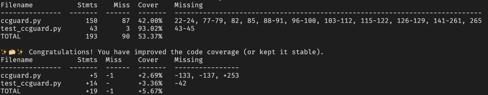
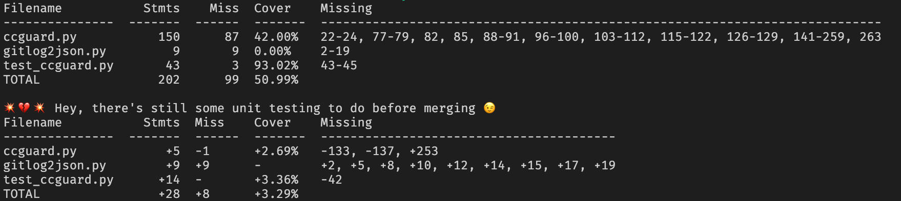
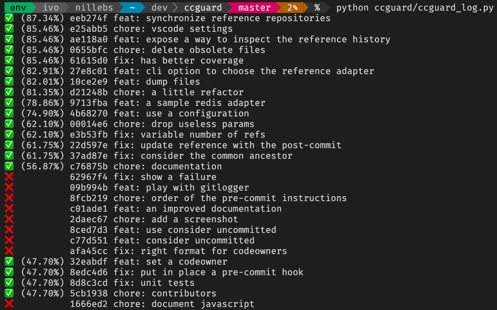

# ccguard

you can only improve! :-)

ccguard compares the current code coverage to past code coverage. ccguard fails unless your new code coverage is equal or better than your past code coverage!





## requires

- python
- git

## welcome beta testers: setup

```sh
# prepare the package and install it
./distrib.sh
```

Should work on both python2 and python3. But python2 is not anymore supported.

## contribute

```sh
./bootstrap.sh
```

please execute flake8, black, pytest and ccguard against all of your changes.
(a pre-commit hook will ensure that everythng is fine before letting you commit)

```sh
./pre-commit
```

## execute this tool

```sh
cd your-favorite-source-folder
# execute unit tests, collecting code coverage here
ccguard.py coverage.xml
# change your code somehow
# execute unit tests, collecting code coverage
# then verify that your code coverage has not decreased
ccguard.py --consider-uncommitted-changes coverage.xml
# if you are rather a visual person, check cc.html and diff.html
ccguard.py --html --consider-uncommitted-changes coverage.xml
# if needed to display the line coverage for each file in the HTML report,
# fine tune the source files path with the --repository argument
ccguard.py --html --consider-uncommitted-changes coverage.xml --repository src/
# allow regressions up to 3%
ccguard.py coverage.xml --tolerance 3
# allow regressions up to 10%, but never descend below 70%
ccguard.py coverage.xml --tolerance 10 --hard-minimum 70
```

please see [how to produce code coverage data](docs/how to produce code coverage data.md) to know how to produce code coverage data in your favourite language.

## display code coverage trends

```sh
python ccguard/ccguard_log.py
```

## synchronize repositories

```sh
# upload the report to a distant redis repository
python ccguard/ccguard_sync.py sqlite redis
# download the report from a distant redis repository
python ccguard/ccguard_sync.py redis sqlite
# limit to a single repository
python ccguard/ccguard_sync.py redis sqlite --repository_id abcd
# limit to a single repository and a single commit
python ccguard/ccguard_sync.py redis sqlite --repository_id abcd --commit_id ef12
```

## launch a local server

```sh
python ccguard/ccguard_server.py
```

## credits

- [Alexandre Conrad](https://pypi.org/user/aconrad/) for his wonderful pycobertura
- all the beta testers for the precious feedback
